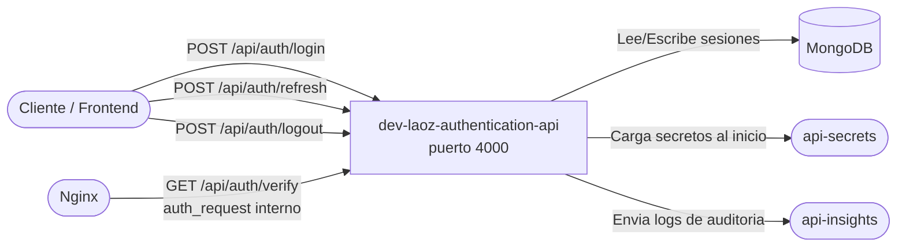
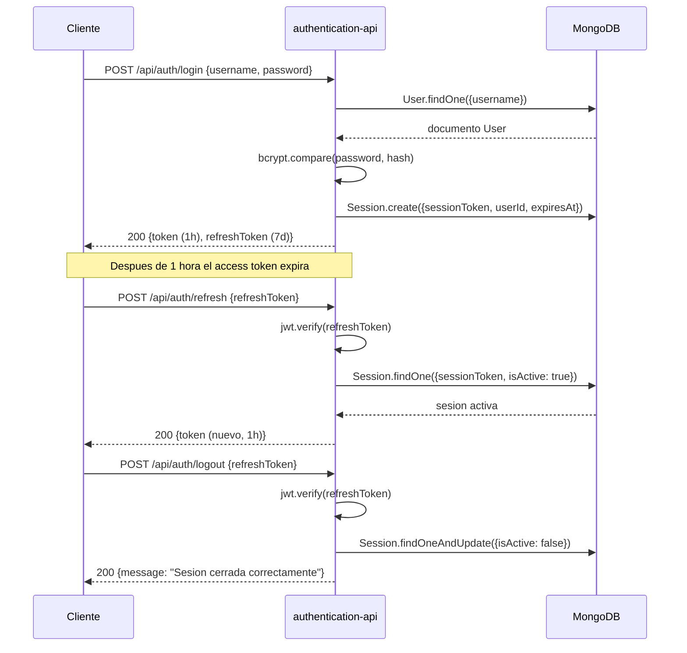

# dev-laoz-authentication-api

Servicio responsable de emitir y revocar tokens JWT para el ecosistema Dev Laoz. Gestiona el ciclo de vida completo de las sesiones de usuario: autenticación con credenciales, emisión de access y refresh tokens, renovacion de tokens expirados y cierre de sesion con invalidacion inmediata en base de datos. Adicionalmente, expone un endpoint interno para que Nginx valide tokens mediante `auth_request` antes de enrutar trafico a servicios protegidos.

## Posicion en la arquitectura



## Flujo de negocio



## Stack tecnico

- Node.js 18 / Express 4
- MongoDB 7 / Mongoose 8
- jsonwebtoken — emision y verificacion de JWT
- bcryptjs — hash de contrasenas
- express-rate-limit — proteccion contra fuerza bruta en login
- express-validator — validacion de entrada
- @dev-laoz/core — carga de secretos remotos y logger de auditoria

## Prerrequisitos

- Node.js 18+
- MongoDB 7+ corriendo y accesible
- Servicio `api-secrets` disponible para carga inicial de secretos
- Variables de entorno configuradas (ver tabla)

## Variables de entorno

| Variable | Descripcion | Valor tipico en Docker |
| --- | --- | --- |
| `PORT` | Puerto en que escucha el servicio | `4000` |
| `MONGO_URI` | URI de conexion a MongoDB | `mongodb://mongo:27017/dev-laoz` |
| `JWT_SECRET` | Clave secreta para firmar JWT | Cargado desde api-secrets |
| `SECRETS_API_URL` | URL del servicio api-secrets | `http://api-secrets:4001` |
| `INSIGHTS_URL` | URL del servicio api-insights | `http://api-insights:4002` |

> `JWT_SECRET` y `MONGO_URI` se obtienen automaticamente via `config.loadRemoteSecrets('authentication-api', ['JWT_SECRET', 'MONGO_URI'])` al arrancar el servidor.

## Instalacion y ejecucion local

```bash
# 1. Instalar dependencias
npm install

# 2. Crear archivo de entorno local
cp .env.example .env
# Editar .env con MONGO_URI y JWT_SECRET

# 3. Ejecutar en modo desarrollo
npm run dev

# 4. Ejecutar tests
npm test

# 5. Ejecutar en produccion
npm start
```

La API estara disponible en `http://localhost:4000`.
La documentacion Swagger estara en `http://localhost:4000/api-docs`.

## Endpoints

| Metodo | Ruta | Auth | Descripcion |
| --- | --- | --- | --- |
| `POST` | `/api/auth/login` | No | Autentica usuario y emite access + refresh token. Rate limit: 5/15 min |
| `POST` | `/api/auth/refresh` | No | Emite nuevo access token usando un refresh token valido |
| `POST` | `/api/auth/logout` | No (refresh token en body) | Invalida la sesion en MongoDB |
| `GET` | `/api/auth/verify` | Bearer token | Verifica validez del token. Uso interno de Nginx `auth_request` |
| `GET` | `/api/auth/health` | No | Healthcheck para Docker y load balancer |

## Integracion con otros servicios

**Este servicio es llamado por:**

- Clientes HTTP (frontend, herramientas CLI) para autenticacion inicial
- Nginx — llama a `GET /api/auth/verify` via `auth_request` antes de enrutar al gateway

**Este servicio llama a:**

- `api-secrets` — carga `JWT_SECRET` y `MONGO_URI` en el arranque
- `api-insights` — envia logs de auditoria (fire-and-forget) para eventos de login, logout y refresh

## Swagger / API Docs

Con el servicio corriendo, la documentacion interactiva esta disponible en:

```text
http://localhost:4000/api-docs
```
